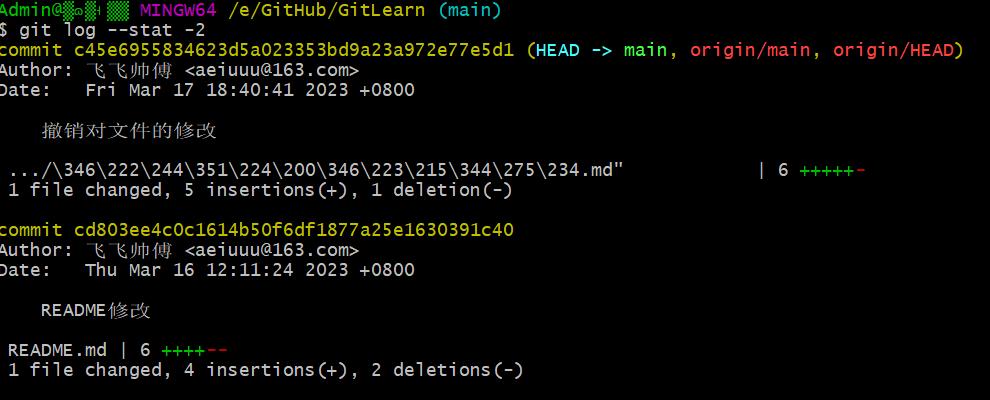

# 日志

## log

`git log`

- `-n` 打印几个日志

- `--stat`  是在git log 的基础上输出文件增删改的统计数据
  

- `--oneline`  简化git log的默认的输出，仅仅输出commit hash 前7个字符串和commit message
  

- `-p`  控制输出每个commit具体修改的内容，输出的形式以diff的形式给出

- `--author="xxx"` 过滤commit,限定输出给定的用户，名字和邮件都可以

- `git log --after '3-16-2023'` 过滤时间
- `git log --pretty=oneline` 简化输出，输出commit hash的所有字符
  

- `–decoreate` 该参数用来控制log输出时，显示对应commit所属的branch和tag信息

– `--graph`  图形化地表示出分支合并历史

## show

- `git show`命令同`git log -p`输出类似，只不过它只显示一个commit的内容，如果不指定commit hash, 它默认输出HEAD指向commit的内容.

## shortlog

- `git shortlog -s` 可以用来统计每个作者的commit数量
- `git shortlog -n` 可以用来对统计的量进行倒序排列

## 与reflog比较

- `git log`可以显示所有提交过的版本信息，不包括已经被删除的 commit 记录和 reset 的操作
- `git reflog`是显示所有的操作记录，包括提交，回退的操作。一般用来找出操作记录中的版本号，进行回退。`git reflog`常用于恢复本地的错误操作。
